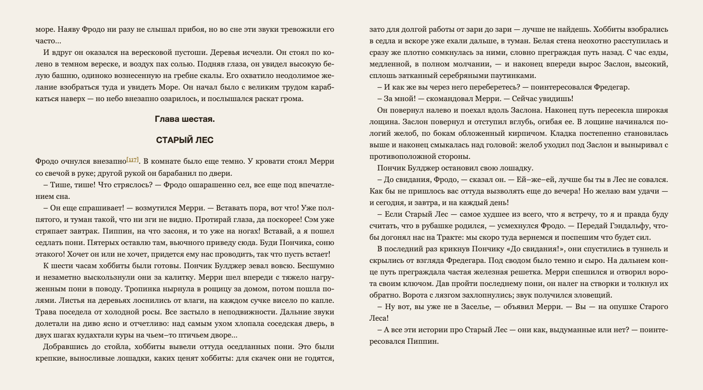
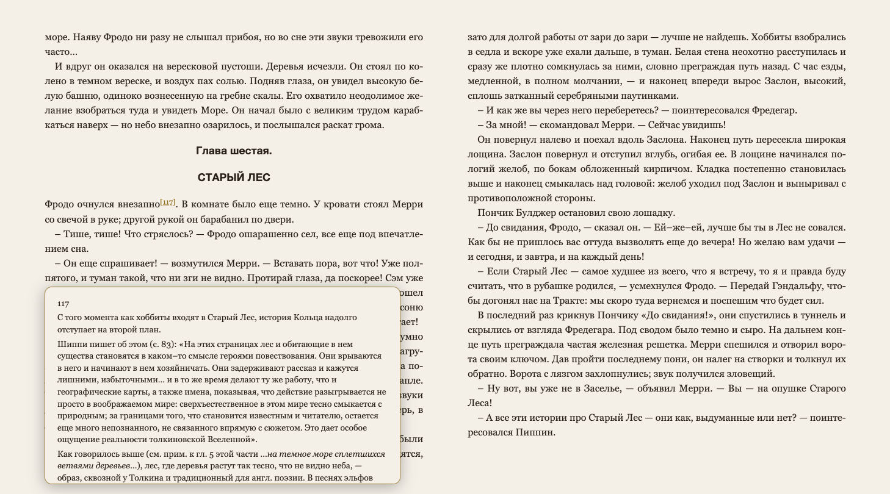
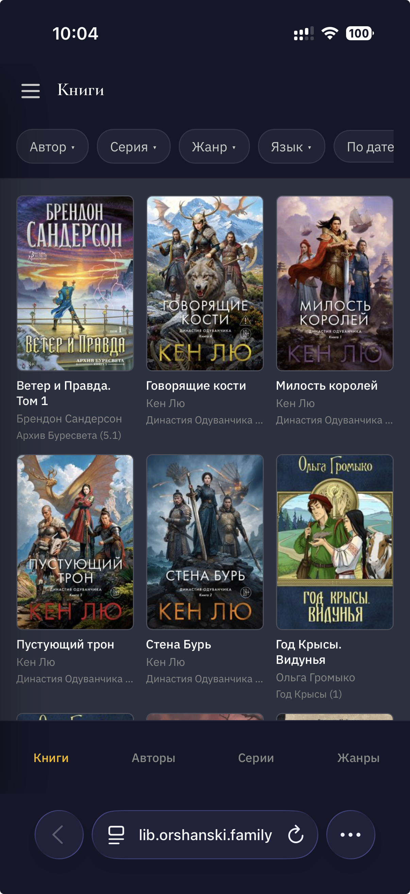
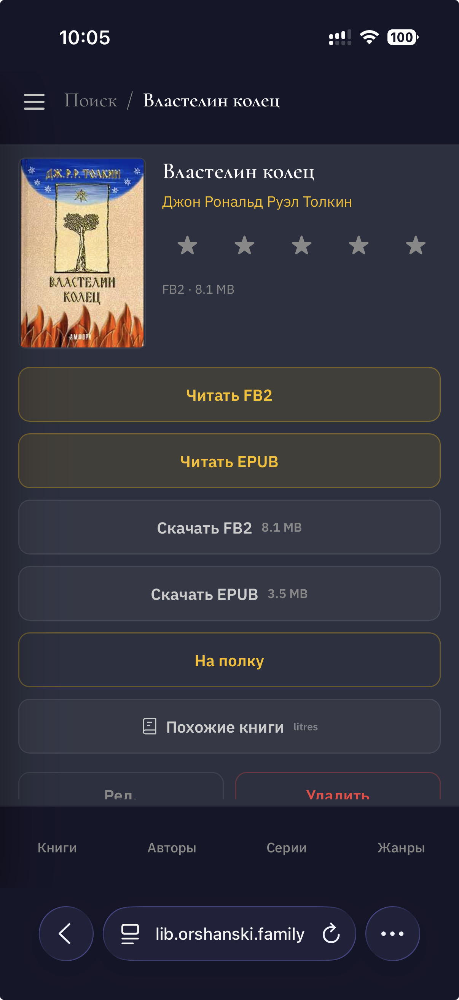
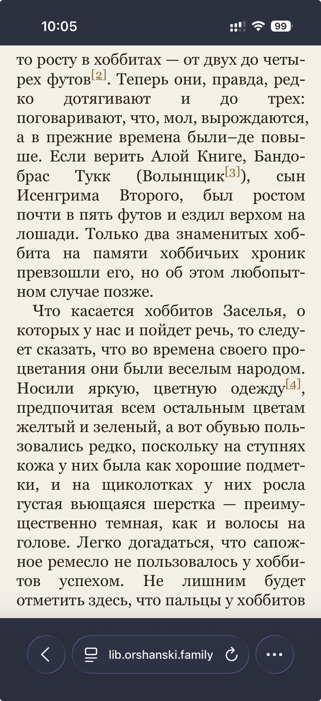

# Librarium

Self-hosted home library for ebooks. Built as a replacement for Calibre-Web.


## Why

We needed a simple way to keep our family book collection — FB2, EPUB, PDF — accessible from any device without installing Calibre or syncing files. Drop a book in, metadata gets extracted, cover appears, everyone reads through a browser.

## Features

### Catalog

Books are displayed as a grid of covers. Filters by author, series, genre, and language are interdependent — picking an author narrows down the available genres, and so on. Sort by date added, title, author, or rating. Infinite scroll that remembers your position when you come back.

Catalog and detail screens use a small sessionStorage-backed metadata cache. Mutations and live server events patch shared library metadata in place when possible, while per-user overlays such as rating, read state, hidden state, and shelves stay user-scoped and refetch only their narrow data when needed. Returning to a page is instant without keeping stale book, shelf, filter, or entity data around.


### Upload

Drag and drop FB2, EPUB, PDF, or ZIP files. Metadata is extracted automatically — title, authors, series, description, language, genres, ISBN, cover. Batch uploads work. Before saving, you can edit metadata, search external catalogs (Litres.ru, Google Books), or swap the cover. Duplicates are detected on the fly.

**PDF metadata via LLM.** PDF files don't usually carry useful metadata in the file itself, so Librarium sends the filename to Claude (Anthropic API) with web search enabled, and gets back title, authors, publisher, year, ISBN, annotation, genres, and a direct cover URL. The cover is downloaded from the publisher's CDN; if that fails, the first page of the PDF is rendered as a fallback. Cover URL fetches go through SSRF protection (no redirects to internal IPs). Works even when the filename is mangled or transliterated ("Savelev_Statistika-i-kotiki.pdf" → "Владимир Савельев / Статистика и котики"). Requires `ANTHROPIC_API_KEY` in env; if absent, falls back to filename-as-title and rendered cover.


### Book page

Cover, description, all metadata, read and download links for each format. Find similar books via Litres.ru. If the book belongs to a series, other books in the series are shown alongside. Rate it (1–5 stars), mark as read, or add to a shelf.


### Editing

Admins can edit everything — title, authors, series, description, genres, language, publisher, ISBN. Replace the cover, add or remove file formats. Pull better metadata from external catalogs in a couple of clicks.


### Search

Fuzzy search across book titles, authors, and series — tolerant to typos, missing letters, word endings, and Russian ё/е. Type a prefix or a misspelling and the right book usually shows up:

- «достоевск» → «Достоевский»
- «сандерсн» → «Сандерсон»
- «короли» → «Королей» (declined form)
- «прошивка» → «Прошивки»

Results are grouped by type (books / authors / series).


### Shelves

Two built-in smart shelves: "Best" collects books rated 4–5 stars, "Reading Now" shows books with saved reading progress (tap the cover to jump straight into the reader). Create your own shelves and add books to them. Each user has their own set.

### Authors, series, genres

Dedicated pages with filters and book counts. Authors, series, and genres are library metadata directories: manually-created entries are visible even before books are attached, with `0` book count. Genre cloud is sized by popularity but still includes empty genres. Navigate freely: author → books → series → all books in series.

Admins can rename and merge authors and series. Genres support smart mapping: when a book arrives with a raw genre code (e.g., `fantasy_fight`), it's stored as-is. On the genre page, an admin can map it to an existing genre like "Боевое фэнтези" — all books are reassigned, and future imports with the same code are resolved automatically.


### Multi-user

Two roles: admin (full access — upload, delete, manage users) and reader (browse, download, rate, shelves). Ratings and shelves are per-user. A reader can hide a book — it disappears from their catalog without affecting others.

### Admin panel

User management, app settings, SMTP configuration for email notifications.


### Built-in reader

Read EPUB, FB2, and PDF directly in the browser. Powered by a local fork of [foliate-js](https://github.com/johnfactotum/foliate-js) for EPUB/FB2 flow layout (the engine technically also supports MOBI/CBZ — Librarium's upload pipeline does not). Customizable theme (dark/warm/light), font family, size, line spacing, hyphenation, and text justification. EPUB/FB2 covers and frontmatter are shown as normal opening pages, but excluded from page totals, reading fraction, and saved reading progress; the first counted text page is `1 / N`. Reading progress and settings are saved per user, per device — pick up where you left off on any device. Footnotes appear as inline popups without leaving the page. Configurable tap zones: split the page into a 3×2 grid and map each zone to prev/next (or zoom in/out for PDFs).

**PDF reader.** Separate reader for PDFs with a bottom navigation bar — drag the slider or type a page number to jump anywhere in a 500-page book. All PDFs are linearized (Fast Web View) at upload time via pikepdf, so PDF.js can start rendering the first page before the whole file is fetched — critical for large scanned books over a network.





### Offline reading (PWA)

Install Librarium as a PWA on your tablet or phone — it works without an internet connection. The entire app shell (HTML, JS, CSS) is precached by a Service Worker on first visit, so the PWA launches instantly even offline.

**How books get cached.** Open any book in the reader while online — all its formats and the cover are automatically saved to IndexedDB on the device. Next time you're on a plane or at a cabin with no Wi-Fi, the book is there. Don't want to wait? Tap the cloud icon on any book's page to download it ahead of time.

**Offline shell.** When the network drops, the app switches to a minimal screen showing only your cached books with reading progress. Tap a cover — the reader opens directly from local storage, no server needed. Reading progress and settings keep saving locally while offline.

**Sync on reconnect.** When the connection returns, accumulated reading positions and settings are pushed to the server automatically. Reading positions use a versioned CAS protocol: forward progress is accepted or rebased, while stale rewinds adopt the newer server position instead of overwriting it. Missed SSE publications are replayed from the durable publication log after the local cursor, so offline or closed PWAs catch up on user-scoped changes such as a book being marked read on another device.

**Housekeeping.** Books untouched for 14 days are evicted automatically. Marking a book as "read" clears its offline copy and local reading position immediately; the server reading position is cleared as well. If another device marks that book read while this PWA is offline, the missed `bookReadChanged` publication is replayed after reconnect and performs the same local cleanup. If the device runs low on storage, least-recently-read books are evicted first to make room for new ones. The cloud icon in the catalog shows which books are available offline (yellow = cached).

**Updates.** When a new version is deployed, the Service Worker detects the change and shows an "Update available" banner — tap to reload with the latest code.

### Mobile

The entire UI adapts to phones and tablets. Bottom tab bar for navigation, swipeable drawer for shelves, and a dedicated mobile reader with optimized margins and safe area support. Install as a PWA from the home screen for a native app experience without browser chrome.

<p>
  
  
  
</p>

### Security

- JWT authentication with HTTP-only cookies (168h rolling refresh)
- CSRF protection — every non-GET `/api/*` request must carry `X-Requested-With: XMLHttpRequest` (browser fetch wrapper sends it automatically; cross-origin form posts cannot)
- CSP, HSTS, TLS 1.2+
- All auth events and data mutations are logged
- SPA route whitelist — unknown paths return 404

#### Nginx CSP for the reader

The built-in reader uses iframes with `blob:` URLs. The following CSP directives are required:

```
add_header Content-Security-Policy "
  default-src 'self';
  style-src 'self' 'unsafe-inline' blob: https://fonts.googleapis.com;
  font-src 'self' https://fonts.gstatic.com;
  img-src 'self' data:;
  connect-src 'self';
  frame-src 'self' blob:;
  script-src 'self' 'unsafe-inline' blob: https://static.cloudflareinsights.com;
  frame-ancestors 'self'
" always;
```

## Stack

| Layer | Technology |
|-------|-----------|
| Backend | Python, FastAPI, Uvicorn |
| Database | SQLite (WAL mode) |
| Auth | JWT + bcrypt |
| Book parsing | lxml (FB2/EPUB), PyMuPDF (PDF cover render), pikepdf (PDF linearize), Pillow (covers) |
| Metadata | Litres.ru, Google Books API, Anthropic Claude (PDF via web search) |
| Frontend | React 19, TypeScript, React Router 7 |
| Reader | Forked foliate-js for EPUB/FB2 flow, PDF.js for PDF |
| Offline | Service Worker (precache), IndexedDB (idb), local-first reader |
| Live data | Durable domain publications over SSE + sessionStorage metadata cache |
| Responsive | Desktop + mobile layouts (820px breakpoint), PWA |
| Build | Vite 6 |
| Styling | Inline CSS, no framework |
| Tests | pytest, Vitest, TypeScript, SonarCloud quality gate |
| CI/CD | GitHub Actions |

## Getting started

### Prerequisites

- Python 3.12+
- Node.js 20+

### Backend

```bash
cd backend
python -m venv venv
source venv/bin/activate
pip install -r requirements.txt
python run.py          # http://localhost:8000
python run.py --dev    # with auto-reload
```

#### Optional: LLM metadata extraction for PDFs

To enable LLM-based metadata extraction for PDF uploads, put your Anthropic API key in `backend/.env`:

```
ANTHROPIC_API_KEY=sk-ant-api03-...
# optional overrides:
# ANTHROPIC_MODEL=claude-sonnet-4-6
# ANTHROPIC_TIMEOUT_SEC=60
```

The file is auto-loaded at startup via `python-dotenv`. Without the key, PDF parsing falls back to filename-as-title and a rendered first-page cover.

### Frontend

```bash
cd frontend
npm install
npm run dev            # http://localhost:5173 (proxies /api → :8000)
npm run build          # production build → dist/
```

### Create an admin user

```bash
cd backend
source venv/bin/activate
python scripts/create_admin.py              # admin / admin
python scripts/create_admin.py myuser pass  # custom credentials
```

### Seed tag mappings

Populate the FB2 genre code → human-readable tag mapping table:

```bash
cd backend
source venv/bin/activate
python scripts/seed_tag_mappings.py ../data/db.sqlite
```

## Project structure

```
librarium-py/
├── backend/
│   ├── run.py              # Uvicorn entry point
│   ├── schema.sql          # DB schema
│   ├── requirements.txt
│   ├── app/
│   │   ├── main.py         # FastAPI app, SPA fallback, CSRF middleware
│   │   ├── config/         # Paths, JWT (168h TTL, 84h refresh), limits, sort manifest
│   │   ├── database.py     # SQLite connection pool
│   │   ├── auth.py         # JWT + bcrypt
│   │   ├── routers/        # API endpoints, including SSE domain events
│   │   ├── services/       # Business logic
│   │   ├── dal/            # Data access layer + queries/ via aiosql
│   │   ├── dtos/           # Pydantic v2 DTOs with camelCase wire aliases
│   │   ├── parsers/        # FB2, EPUB
│   │   ├── enrichers/      # PDF: Anthropic LLM metadata, PyMuPDF cover render, cover-fetcher
│   │   ├── providers/      # Litres, Google Books lookup
│   │   ├── pdf_linearize.py # pikepdf linearize for Fast Web View
│   │   └── cover_embedder.py # Embed cover into FB2/EPUB for exported files
│   ├── scripts/            # One-off scripts (create_admin, seed_tag_mappings, normalize_tag_names, linearize_existing_pdfs)
│   ├── migrations/         # Historical manual backend migrations (001_user_cascade, 002_drop_fts5)
│   └── tests/              # pytest suite
├── scripts/
│   └── migrations/         # Manual operational migrations for existing SQLite databases
├── frontend/
│   ├── public/sw.js            # Service Worker (precache template)
│   ├── scripts/                # Build scripts (SW asset injection)
│   ├── src/
│   │   ├── pages/              # route-level page components + desktop/mobile reader pages
│   │   ├── components/         # shared components (incl. OfflineShell, EbookReader, PdfReader)
│   │   ├── components/desktop/ # desktop layout components
│   │   ├── components/mobile/  # mobile layout components
│   │   ├── hooks/              # custom hooks (reader, offline, PWA, cache-aware pages)
│   │   ├── utils/              # utilities (offline-storage IDB, reader sync/input, sanitize-html, …)
│   │   ├── cache/              # sessionStorage metadata cache + projection patch helpers
│   │   ├── config/             # client-side manifests (sort config)
│   │   ├── constants/          # reader defaults and theme constants
│   │   ├── domain/             # typed domain events and read-model classifiers
│   │   ├── offline/            # offline bootstrap and cache cleanup hooks
│   │   ├── sse/                # EventSource bridge for server domain events
│   │   ├── scroll/             # list scroll validity / restoration counters
│   │   ├── types/              # reader-specific TypeScript contracts
│   │   ├── test/               # Vitest/MSW setup
│   │   ├── vendor/foliate-js/  # Forked reader (owned code, no upstream sync)
│   │   └── responsive.ts       # Breakpoint provider (820px)
│   └── vite.config.ts
├── docs/
│   ├── spec.md                 # Technical specification
│   └── screenshots/            # UI screenshots
└── data/                       # Not in git
    ├── db.sqlite
    ├── library/{id}/           # Book files and covers
    ├── thumbs/                 # Thumbnail cache
    └── uploads/                # Temporary upload staging
```
