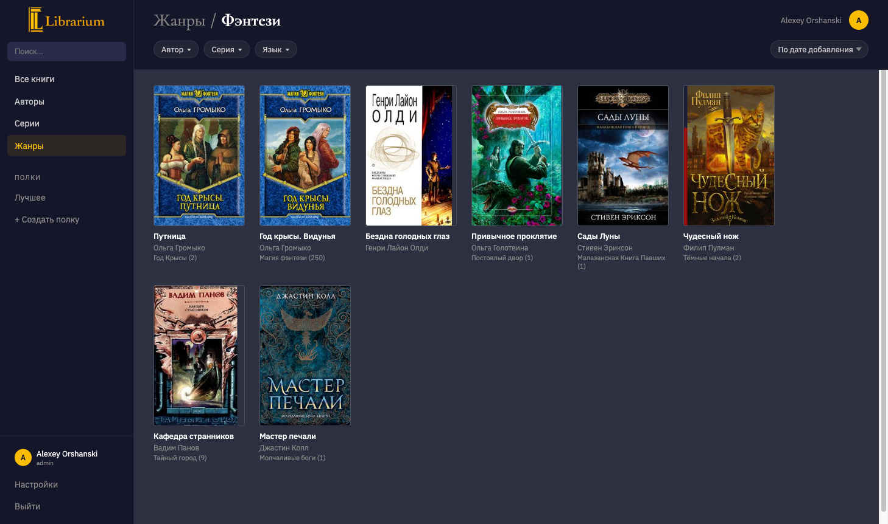
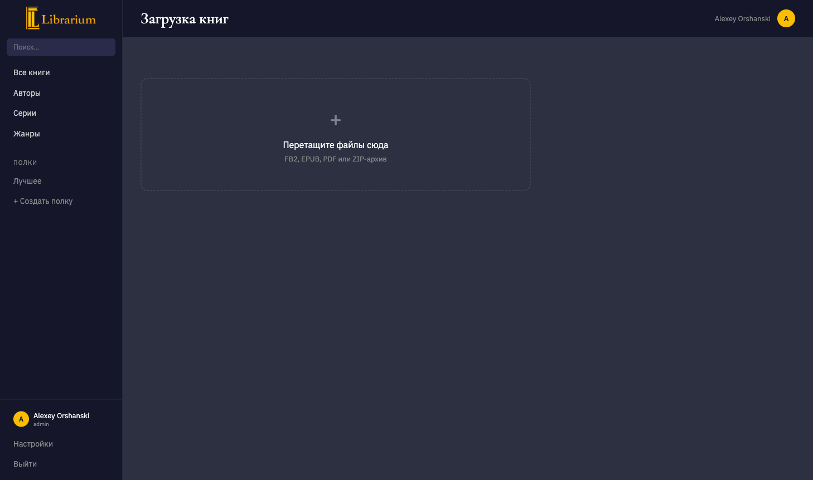
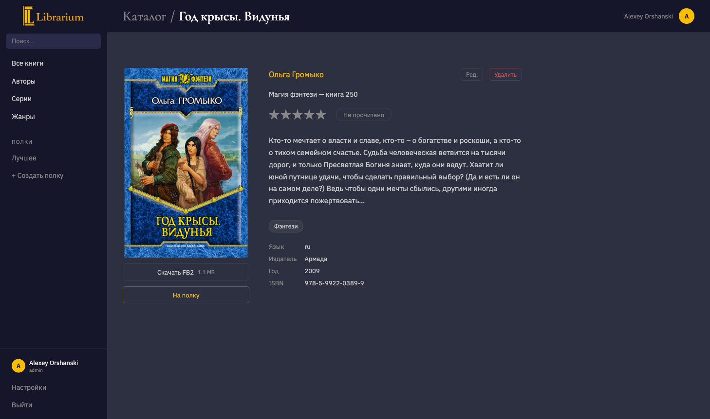
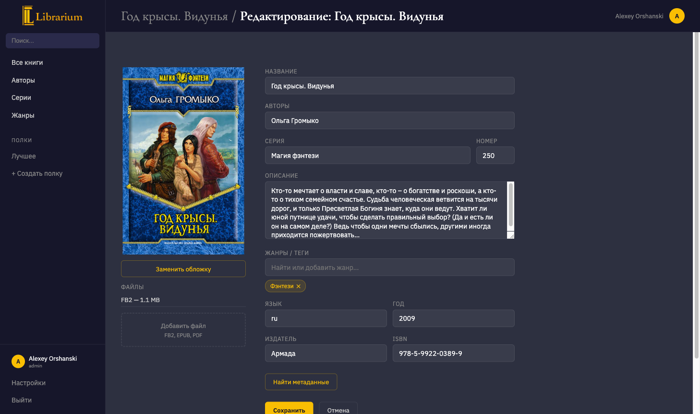
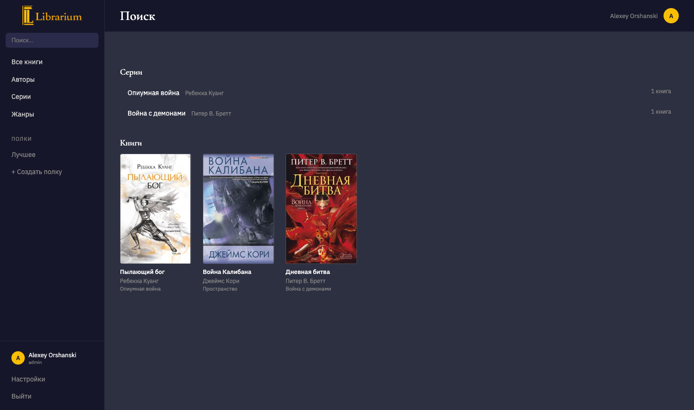
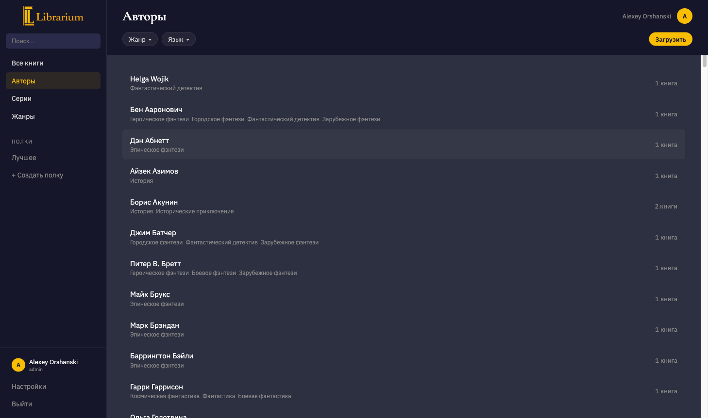
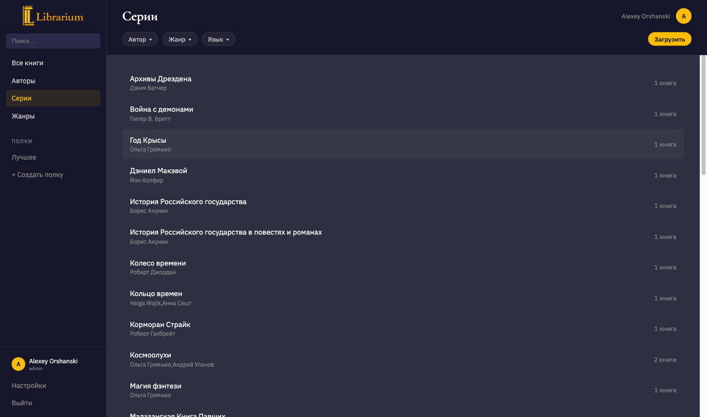
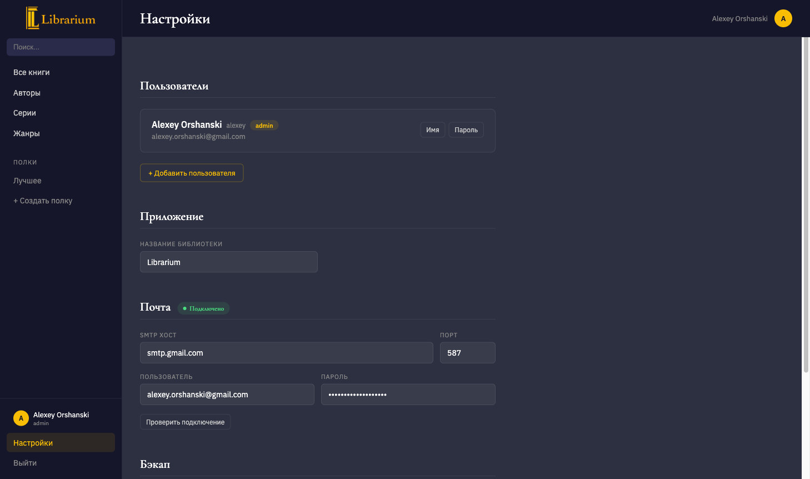

# Librarium

Self-hosted home library for ebooks. Built as a replacement for Calibre-Web.


## Why

We needed a simple way to keep our family book collection — FB2, EPUB, PDF — accessible from any device without installing Calibre or syncing files. Drop a book in, metadata gets extracted, cover appears, everyone reads through a browser.

## Features

### Catalog

Books are displayed as a grid of covers. Filters by author, series, genre, and language are interdependent — picking an author narrows down the available genres, and so on. Sort by date added, title, author, or rating. Infinite scroll that remembers your position when you come back.



### Upload

Drag and drop FB2, EPUB, PDF, or ZIP files. Metadata is extracted automatically — title, authors, series, description, language, genres, ISBN, cover. Batch uploads work. Before saving, you can edit metadata, search external catalogs (Litres.ru, Google Books), or swap the cover. Duplicates are detected on the fly.



### Book page

Cover, description, all metadata, download links for each format. If the book belongs to a series, other books in the series are shown alongside. Rate it (1–5 stars), mark as read, or add to a shelf.



### Editing

Admins can edit everything — title, authors, series, description, genres, language, publisher, ISBN. Replace the cover, add or remove file formats. Pull better metadata from external catalogs in a couple of clicks.



### Search

Searches across book titles, authors, and series names. Results are grouped by type.



### Shelves

A built-in "Best" shelf automatically collects books rated 4–5 stars. Create your own shelves and add books to them. Each user has their own set.

### Authors, series, genres

Dedicated pages with filters and book counts. Genre cloud sized by popularity. Navigate freely: author → books → series → all books in series.






### Multi-user

Two roles: admin (full access — upload, delete, manage users) and reader (browse, download, rate, shelves). Ratings and shelves are per-user. A reader can hide a book — it disappears from their catalog without affecting others.

### Admin panel

User management, app settings, SMTP configuration for email notifications.



### Security

- JWT authentication with HTTP-only cookies
- CSP, HSTS, TLS 1.2+
- All auth events and data mutations are logged
- SPA route whitelist — unknown paths return 404

## Stack

| Layer | Technology |
|-------|-----------|
| Backend | Python, FastAPI, Uvicorn |
| Database | SQLite (WAL mode) |
| Auth | JWT + bcrypt |
| Book parsing | lxml (FB2/EPUB), Pillow (covers) |
| Metadata | Litres.ru, Google Books API |
| Frontend | React 19, TypeScript, React Router 7 |
| Responsive | Desktop + mobile layouts (768px breakpoint) |
| Build | Vite 6 |
| Styling | Inline CSS, no framework |
| Tests | pytest (backend), Vitest (frontend) |
| CI/CD | GitHub Actions |

## Getting started

### Prerequisites

- Python 3.12+
- Node.js 25+

### Backend

```bash
cd backend
python -m venv venv
source venv/bin/activate
pip install -r requirements.txt
python run.py          # http://localhost:8000
python run.py --dev    # with auto-reload
```

### Frontend

```bash
cd frontend
npm install
npm run dev            # http://localhost:5173 (proxies /api → :8000)
npm run build          # production build → dist/
```

### Create an admin user

```bash
cd backend
source venv/bin/activate
python -c "
from app.database import get_db, init_db
from app.auth import hash_password
init_db()
db = get_db()
db.execute(
    'INSERT INTO users (username, password_hash, role) VALUES (?, ?, ?)',
    ('admin', hash_password('admin'), 'admin')
)
db.commit()
"
```

## Project structure

```
librarium-py/
├── backend/
│   ├── run.py              # Uvicorn entry point
│   ├── schema.sql          # DB schema
│   ├── requirements.txt
│   └── app/
│       ├── main.py         # FastAPI app, SPA fallback
│       ├── config.py       # Paths, JWT settings, limits
│       ├── database.py     # SQLite connection pool
│       ├── auth.py         # JWT + bcrypt
│       ├── routers/        # API endpoints (14 modules)
│       ├── dal/            # Data access layer (8 modules)
│       ├── parsers/        # FB2, EPUB, PDF metadata extraction
│       ├── providers/      # Litres, Google Books lookup
│       └── tests/          # pytest suite
├── frontend/
│   ├── src/
│   │   ├── pages/              # Page components
│   │   ├── components/         # Shared components
│   │   ├── components/desktop/ # Desktop layout
│   │   ├── components/mobile/  # Mobile layout
│   │   └── responsive.ts       # Breakpoint provider
│   └── vite.config.ts
├── docs/
│   ├── spec.md                 # Technical specification
│   └── screenshots/            # UI screenshots
└── data/                       # Not in git
    ├── db.sqlite
    ├── library/{id}/           # Book files and covers
    ├── thumbs/                 # Thumbnail cache
    └── uploads/                # Temporary upload staging
```
